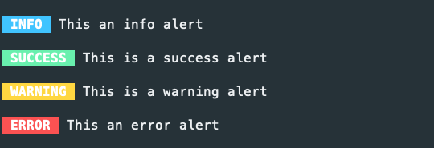

# Console

The console component is to make console utilities and applications, there is no plan for a command runner.

## Command

Create a `Command` in your `app\Command` folder.

```php
<?php declare(strict_types=1);

namespace App\Command;

use Lightning\Console\Arguments;
use Lightning\Console\ConsoleIo;
use Lightning\Console\AbstractCommand as Command;

class HelloWorldCommand extends Command
{
    protected string $name = 'hello';
    protected string $description = 'hello world command';

    protected function initialize(): void
    {
        $this->addArgument('name', [
            'description' => 'name to use',
            'default' => 'world'
        ]);
    }

    protected function execute(Arguments $args, ConsoleIo $io): int
    {
        $this->out(sprintf('Hello <yellow>%s</yellow>!', $args->getArgument('name')));

        return self::SUCCESS;
    }
}
```


## Console Application


To create a Console Application 

```bash
#!/usr/bin/env php
<?php
use Lightning\Console\ConsoleIo;
use function Lightning\Dotenv\env;
use Lightning\Migration\Migration;
use Lightning\Console\ConsoleApplication;
use Lightning\Console\ConsoleArgumentParser;
use Lightning\Migration\Command\MigrateUpCommand;
use Lightning\Migration\Command\MigrateDownCommand;

include dirname(__DIR__) . '/config/bootstrap_cli.php';

$io = new ConsoleIo();
$pdo = new PDO(env('DB_URL'), env('DB_USERNAME'), env('DB_PASSWORD'));
$migration = new Migration($pdo, dirname(__DIR__) . '/database/migrations');
$parser = new ConsoleArgumentParser();

$application = new ConsoleApplication($io);
$application->setName('migrate')
            ->setDescription('Database migration');
            
$application->add(new MigrateUpCommand($parser, $io, $migration));
$application->add(new MigrateDownCommand($parser, $io, $migration));
exit($application->run($argv));
```

## ConsoleIO

The ConsoleIO object for input and output.


```php
$io->out('hello'); // to stdout
$io->err('opps'); // to stderr
$io->nl(); // new line
$io->hr(); // horiziontal rule
```

## Inputs

```php
$name = $io->ask();
$continue = $io->ask('Continue ?','n'); // adds a default 
$continue = $io->askChoice('Continue ? (name)',['y','n']); 
```

### Alerts

Display alerts to users, warning and error will be displayed `stderr`.

```php
$io->info('INFO', 'This an info alert');
$io->success('SUCCESS', 'This is a success alert');
$io->warning('WARNING', 'This is a warning alert');
$io->error('ERROR', 'This an error alert');
```



### Progress Bar

Display a progress bar to user

```php
$io->progressBar(50, 100);
```


### Status

Often when running commands you are carrying out multiple tasks, and its nice to show these to the user. This
is where the status method comes in handy, statuses are setup for `ok`, `warning` and `error`.

```php
$io->status('ok', 'Delete file');
$io->status('warning', 'Directory is writable');
$io->status('error', 'Create directory');
```


You can also add your own status

```php
$io->setStatus('skipped','blue');
$io->setStatus('ignored','yellow');
```


## Testing

Create your PHP test file and add the `ConsoleIntegrationTestTrait`, then create the `Command` object using the `TestConsoleIo` and call the `setupIntegrationTesting` function.


```php
<?php declare(strict_types=1);

namespace App\Command;

use PHPUnit\Framework\TestCase;
use Lightning\Console\TestSuite\ConsoleIntegrationTestTrait;

final class HelloWordCommandTest extends TestCase
{
    use ConsoleIntegrationTestTrait;

    public function setUp(): void 
    {
        $command = new HelloWorldCommand(new ConsoleArgumentParser(), new TestConsoleIo());
        $this->setupIntegrationTesting($command);
    }


    public function testExitSuccesss(): void
    {
        $this->execute();
        $this->assertExitSuccess();
        $this->assertOutputContains('Hello world!');
    }
}
```

To execute the `Command` with arguments

```php
$this->execute(['--bold','jon']);
```

If your command asks for input from the user, you can pass the input in the `execute method`

```php
$this->execute([],['jon']);
```

### Assertion methods

```php
$this->assertExitSuccess();
$this->assertExitError();
$this->assertExitCode(3);

// stdout
$this->assertOutputContains('x');
$this->assertOutputNotContains('x');
$this->assertOutputEmpty();
$this->assertOutputNotEmpty();

$this->assertOutputMatchesRegularExpression('/foo/');
$this->assertOutputDoesNotMatchRegularExpression('/foo/');

// stderr
$this->assertErrorContains('x');
$this->assertErrorNotContains('x');
$this->assertErrorEmpty();
$this->assertErrorNotEmpty();

$this->assertErrorMatchesRegularExpression('/foo/');
$this->assertErrorDoesNotMatchRegularExpression('/foo/');
```